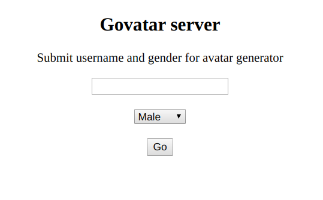

## govatar server
After startup (howto [below](#Usage)), available at http://localhost:8080  
Empty username generates random avatar of selected gender



## Usage
```bash
    govatar/server$ go run .
```

## Docker
```bash
    govatar/server$ docker build -t govatar-server .
    govatar/server$ docker run -d --name=govatar-server -p 8080:8080 govatar-server:latest
```